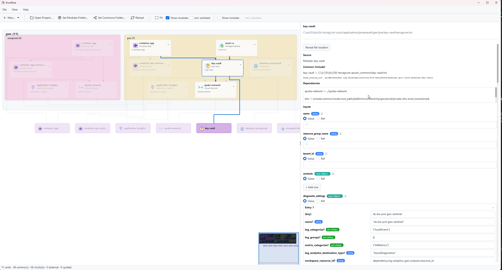

# GruntFace

A JavaFX desktop tool for exploring and editing Terragrunt configurations — parses `terragrunt.hcl` units and modules, renders them as a dependency graph, and lets you inspect and edit inputs.



## Tech stack

- **Java 25** (toolchain auto-provisioned by Gradle)
- **JavaFX 25** — UI (controls, fxml, swing)
- **AtlantaFX** + **ControlsFX** + **Ikonli** — theming and widgets
- **RichTextFX** — HCL editor
- **hcl4j** — HCL parsing
- **Eclipse ELK** — graph layout
- **Gradle (Kotlin DSL)** with `jlink` and `graalvm-native` plugins

Main class: `solutions.onz.toolbox.gruntface.app.GruntFaceApplication`
Native-image entry: `solutions.onz.toolbox.gruntface.app.Launcher`

## Build & run

```powershell
.\gradlew.bat run            # run the app
.\gradlew.bat build          # compile + test
.\gradlew.bat jlink          # produce runtime image under build/image
.\gradlew.bat installDist    # produce distribution under build/install
.\gradlew.bat nativeCompile  # GraalVM native image (requires GraalVM toolchain)
```

Versioning: `version` and `buildNumber` live in `gradle.properties`. The `incrementBuild` task bumps the build number.

## Layout

```
src/main/java/solutions/onz/toolbox/gruntface/
  app/         application bootstrap, themes, preferences
  hcl/         HCL parsing + inputs rendering (hcl4j)
  model/       domain model (Unit, Module, CommonHcl, InputValue, ...)
  discovery/   scanning a Terragrunt tree
  create/      scaffolding new units/modules
  name/        name resolution / path conventions
  azure/       Azure-specific helpers
  ui/          JavaFX views
    graph/     ELK-backed diagram (cards, edges, containers, layout)
    edit/      HCL editor
    inspector/ properties / dependencies panel
    create/    new-unit wizard
    help/      in-app help
src/main/resources/   FXML, CSS, icons, help markdown
```

## Conventions

- Module path: `solutions.onz.toolbox.gruntface` (JPMS — see `module-info.java`).
- UI strings, icons, and FXML live under `src/main/resources/...` mirroring the Java package path.
- Tests use JUnit 5 (`useJUnitPlatform()`).

## Git

`main` is the integration branch. Feature work happens on `feat/*` branches. Commits and pushes are done manually.
